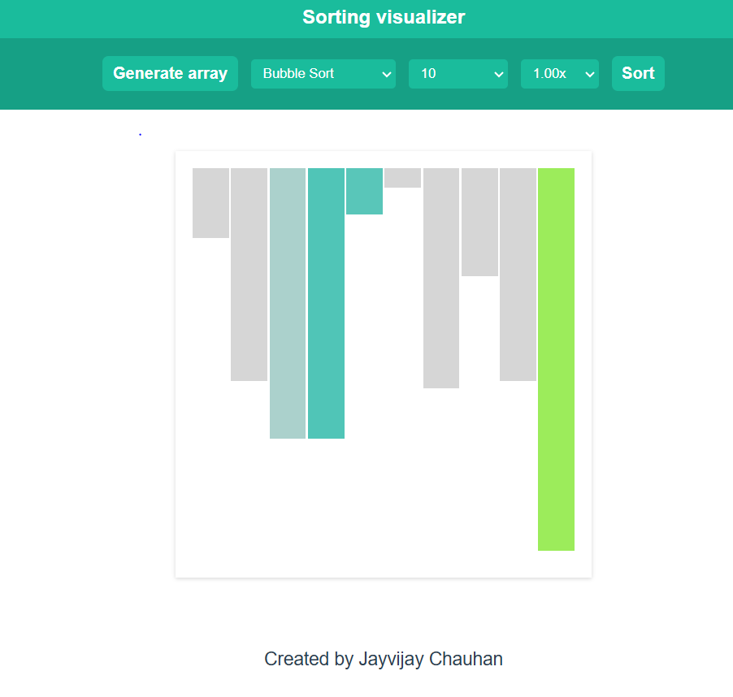
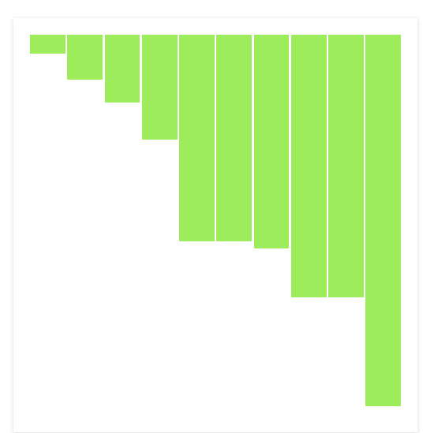
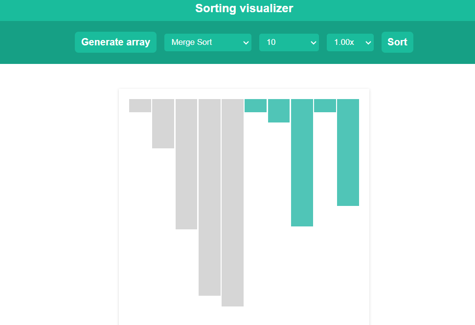
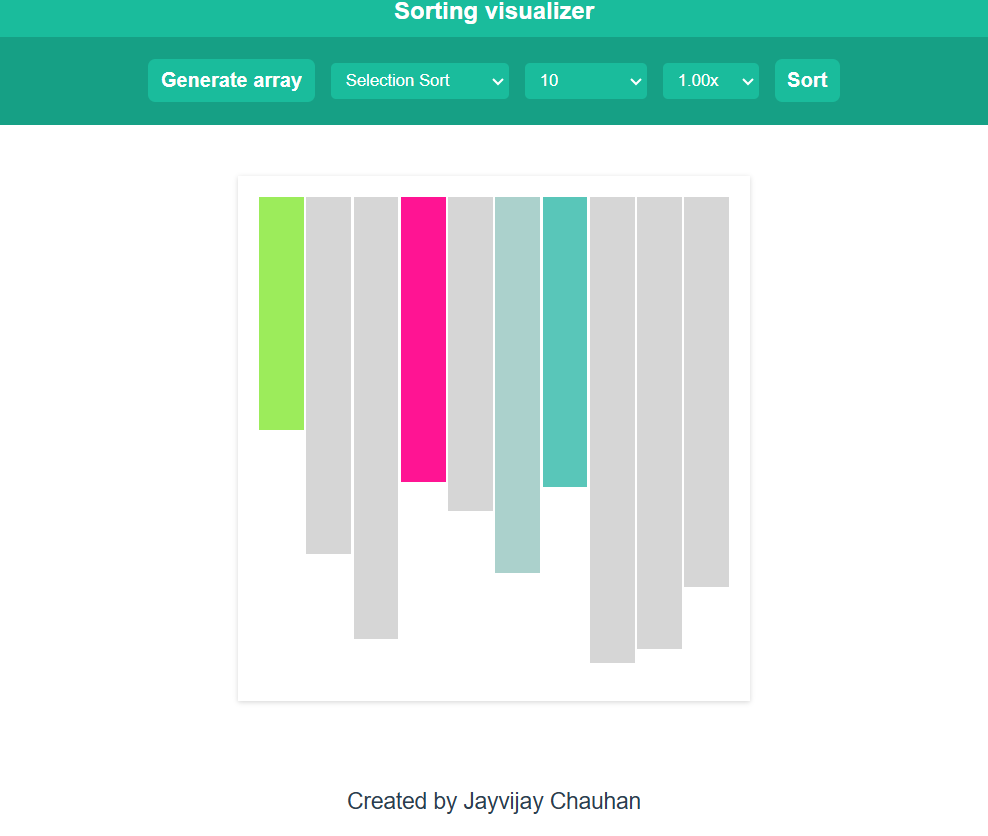

# Sorting Visualizer

A web-based sorting visualizer that helps you understand and visualize different sorting algorithms in action.

## 🚀 Features

- **Multiple Sorting Algorithms**: Bubble Sort, Selection Sort, Insertion Sort, Merge Sort, Quick Sort, etc.
- **Interactive UI**: Control the speed and size of the array.
- **Real-time Visualization**: Watch how each algorithm sorts the elements step by step.
- **Dark Mode Support**: (if applicable)
- **Built with Vue.js & Element Plus**

## 🛠️ Technologies Used

- **Frontend**: Algorithms,Javascripts,Html
- **Backend**: N/A (Frontend-based application)
- **Styling**: CSS, Element Plus Components

 ## 📸 Screenshots

### 🖼️ Image 1


### 🖼️ Image 2


### 🖼️ Image 3


### 🖼️ Image 4

## 🔧 Installation

Clone the repository and install dependencies:

```sh
git clone https://github.com/JAYVIJAYCHAUHAN/sortingV.git
cd sortingV
```

## 📌 Usage

Start the development server:

index.html

Open your browser and visit `http://localhost:5173` (or the port displayed in the terminal).

## 🧩 Sorting Algorithms Included

- Bubble Sort
- Selection Sort
- Insertion Sort
- Merge Sort
- Quick Sort
- (Add any other sorting algorithms you have implemented)

## 🎯 Future Enhancements

- Add more sorting algorithms (Heap Sort, Radix Sort, etc.)
- Improve animations
- Add user customization options
- Optimize performance for large arrays

## 🤝 Contributing

Feel free to fork the repository and submit pull requests!

## 📜 License

This project is open-source and available under the [MIT License](LICENSE).

## 📬 Contact

For any issues or suggestions, feel free to open an issue or contact me at [Your Email or GitHub Profile].

